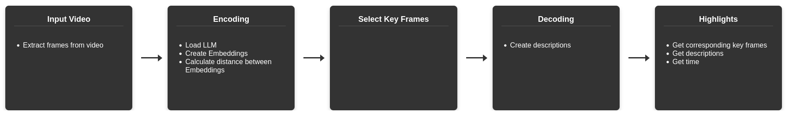

# SBR2025
Recent advancements in robotics have positively impacted the adoption of autonomous systems supporting routine tasks. Autonomous robots are now present in vehicles, medical procedures, industrial plants, and even in our homes. However, large-scale adoption requires the storage and analysis of massive amounts of data to understand robot behavior and prevent potential failures in sensitive tasks. As a result, analytical tasks have become increasingly complex, often exceeding human capabilities due to the time required for manual analysis. In low-resource environments, large logs are typically reviewed only when an incident is reported. In the next generation of robotics, enhanced problem-solving reasoning will be essential to map and understand occurrences along a robot’s path. To address these challenges, this article proposes a key frame selection method integrated with large language models to summarize video logs from autonomous robots. Our method selects the most relevant frames to generate meaningful summaries, producing a condensed archive that highlights the key events captured in the original footage. As a result, each video is reduced to a summary composed of descriptions based on approximately 0.5% of the total frames. These summaries are presented as paragraph-sized documents, effectively representing the essential content of the original videos.

## Pipeline

That is an illustration of the five steps applied to generate the video summaries.

## Dataset
This work use the dataset Oxford RobotCar Dataset. The full dataset is available for download at: http://robotcar-dataset.robots.ox.ac.uk

# RUN
